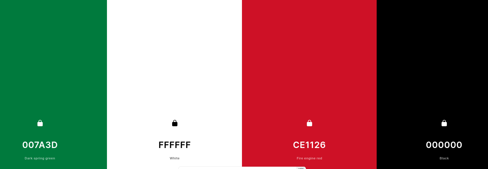

# [KUWAIT TRAVEL WEBSITE](https://ashlaw96.github.io/kuwait-travel-website)

[](https://github.com/AshLaw96/kuwait-travel-website/commits/main)
[](https://github.com/AshLaw96/kuwait-travel-website/commits/main)
[](https://github.com/AshLaw96/kuwait-travel-website)

# Kuwait Escapes

Kuwait Escapes is a travel website hoping to both encourage and inform people to visit Kuwait and explore all of it Arabian wonders. 

Users enticed on to the website, will find an abundance of information about the top attractions, the most beautiful sceneries, and the most exceptional accommodations they can stop at if they visit Kuwait. The demographic of the site is directed to anyone going or wanting to go explore Kuwait.


source: [amiresponsive](https://ui.dev/amiresponsive?url=https://ashlaw96.github.io/kuwait-travel-website)

## UX

The purpose of Kuwait Escapes is to help the user avoid travel headaches and the stress of finding the perfect accommodation.

Kuwait Escapes, will have a home page that has wealth of information to help users with their holiday worries. There will then be a gallery page to visually allure the user with the beautiful sites of Kuwait. The final page will contain a form that the user can fill out with basic personal information, which when submitted will inform the user that someone will be in touch.   

### Colour Scheme

The colours of the website will use the Kuwait flag to design different features on the site.

- `#FFFFFF` used for primary text.
- `#007A3D` used for primary highlights.
- `#000000` used for secondary text.
- `#CE1126` used for secondary highlights.

Example: https://coolors.co/007a3d-ffffff-ce1126-000000

I used [coolors.co](https://coolors.co/007a3d-ffffff-ce1126-000000) to generate my colour palette.



I've used CSS `:root` variables to easily update the global colour scheme by changing only one value, instead of everywhere in the CSS file.

```css
:root {
    /* P = Primary | S = Secondary */
    --p-text: #FFFFFF;
    --p-highlight: #007A3D;
    --s-text: #000000;
    --s-highlight: #CE1126;
}
```

### Typography

- [Arabic Ramadhan](https://www.dafont.com/arabic-ramadhan.font?back=theme&text=Hello) was used for the secondary texts.

- [Ramadhan Mubarok](https://www.dafont.com/ramadhan-mubarok.font?text=Kuwait&back=theme) was used for primary text like headers and titles.

- [Arabian Night](https://www.dafont.com/arabian-night.font?text=First+name&back=theme) was used for the form text.

- [Font Awesome](https://fontawesome.com) icons were used throughout the site, such as the social media icons in the footer.

## User Stories

### New Site Users

- As a new site user, I would like to be able to quickly find where to stop, so that I can move on to decide what to pack.
- As a new site user, I would like to change pages without having to scroll to the top of the screen, so that I can .
- As a new site user, I would like to see a variety of images, so that I can see what Kuwait looks like.
- As a new site user, I would like to see videos of what activities can be done, so that I can decide what I would like to do when I'm there.
- As a new site user, I would like to be able to follow the websites social media, so that I can keep up to date with any new information.

### Returning Site Users

- As a returning site user, I would like to be able to keep my details in the form, so that I don't have to refill it every time I leave the site and return at a later date.
- As a returning site user, I would like to be able to click on images and see them full-screen, so that I can see any particular image clearer.
- As a returning site user, I would like to have easy to understand the information given, so that I can tell others about it.
- As a returning site user, I would like to watch more videos, so that I can see different food establishments.
- As a returning site user, I would like to be able to click on links that take me to specific accommodation, so that I can find out more about what they have to offer.

## Wireframes

To follow best practice, wireframes were developed for mobile, tablet, and desktop sizes.
I've used [Moqups](https://my.moqups.com/login) to design my site wireframes.

### Mobile Wireframes

<details>
<summary> Click here to see the Mobile Wireframes </summary>

Home
  - 

Gallery
  - 

Form
  - 

404 Page
  - 

</details>

### Tablet Wireframes

<details>
<summary> Click here to see the Tablet Wireframes </summary>

Home
  - 

Gallery
  - 

Form
  - 

404
  - 

</details>

### Desktop Wireframes

<details>
<summary> Click here to see the Desktop Wireframes </summary>

Home
  - 

Gallery
  - 

Form
  - 

404
  - 

</details>

