# [KUWAIT TRAVEL WEBSITE](https://ashlaw96.github.io/kuwait-travel-website)

[](https://github.com/AshLaw96/kuwait-travel-website/commits/main)
[](https://github.com/AshLaw96/kuwait-travel-website/commits/main)
[](https://github.com/AshLaw96/kuwait-travel-website)

# Kuwait Escapes

Kuwait Escapes is a travel website hoping to both encourage and inform people to visit Kuwait and explore all of it Arabian wonders. 

Users enticed on to the website, will find an abundance of information about the top attractions, the most beautiful sceneries, and the most exceptional accommodations they can stop at if they visit the country of Kuwait. The demographic of the site is directed to anyone going or wanting to go explore Kuwait.

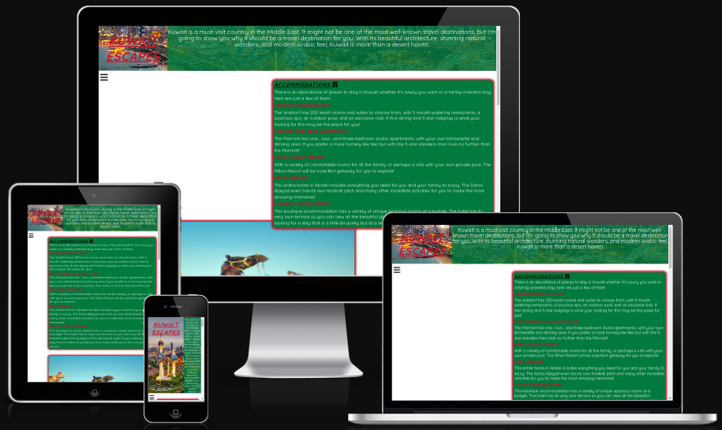

source: [amiresponsive](https://ui.dev/amiresponsive?url=https://ashlaw96.github.io/kuwait-travel-website)

## UX

The purpose of Kuwait Escapes is to help the user avoid travel headaches and the stress of finding the perfect accommodation and activities to do.

Kuwait Escapes, will have a home page that has wealth of information to help users with their holiday worries. There will then be a gallery page to visually allure the user with the beautiful sites of Kuwait. The final page will contain a form that the user can fill out with basic personal information, which when submitted will take the user to a confirmation page letting them know that someone will be in touch.   

### Colour Scheme

The tone of the desert, such as sand, sun and clouds will be the basis for the colour scheme. I will also integrate the red, green, black and white which make up the colours of the Kuwait flag.

- `#CE1126` used for primary text.
- `#FFFFF0` used for primary highlights.
- `#FF7B1F` used for secondary text.
- `#F2DDA0` used for secondary highlights.
- `#007A3D` used for links.
- `#9ACAE7` used for background colour.
- `#000` used for different elements.
- `#FFF` used for shadows.
- `#FFEAAA` used for shadows.


I used [coolors.co](https://coolors.co/ce1126-fffff0-ff7b1f-f2dda0-007a3d) to generate my colour palette.

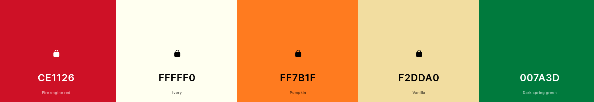

I've used CSS `:root` variables to easily update the global colour scheme by changing only one value, instead of everywhere in the CSS file.

```css
:root {
     /* P = Primary | S = Secondary L = Links */
    --p-text: #CE1126;
    --p-highlight: #FFFFF0;
    --s-text: #FF7B1F;
    --s-highlight: #F2DDA0;
    --l-highlight: #007A3D;
}
```

### Typography

- [Google Font](https://fonts.google.com/specimen/Quicksand?query=quicksand) The 'Quicksand' font was used to style text throughout the site
- [Font Awesome](https://fontawesome.com) Icons were used throughout the site, such as the social media icons in the footer.

## User Stories

### New Site Users

- As a new site user, I would like to be able to quickly find where to stop, so that I can move on to decide what to pack.
- As a new site user, I would like to change pages without having to scroll to the top of the screen, so that I can .
- As a new site user, I would like to see a variety of images, so that I can see what Kuwait looks like.
- As a new site user, I would like to see videos of what activities can be done, so that I can decide what I would like to do when I'm there.
- As a new site user, I would like to be able to follow the websites social media, so that I can keep up to date with any new information.

### Returning Site Users

- As a returning site user, I would like to be able to keep my details in the form, so that I don't have to refill it every time I leave the site and return at a later date.
- As a returning site user, I would like to be able to click on images and see them full-screen, so that I can see any particular image clearer.
- As a returning site user, I would like to have easy to understand the information given, so that I can tell others about it.
- As a returning site user, I would like to watch more videos, so that I can see different food establishments.
- As a returning site user, I would like to be able to click on links that take me to specific accommodation, so that I can find out more about what they have to offer.

## Wireframes

To follow best practice, wireframes were developed for mobile, tablet, and desktop sizes.
I've used [Moqups](https://my.moqups.com/login) to design my site wireframes.

### Mobile Wireframes

<details>
<summary> Click here to see the Mobile Wireframes </summary>

Home
  - 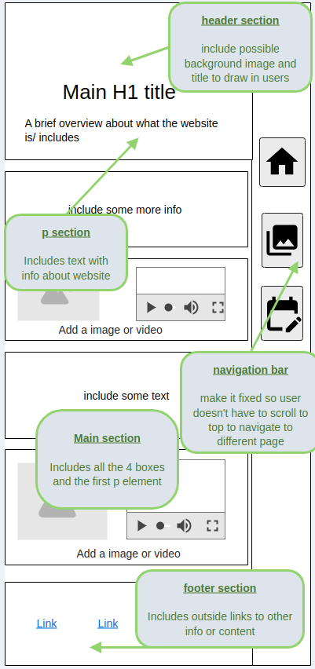

Gallery
  - 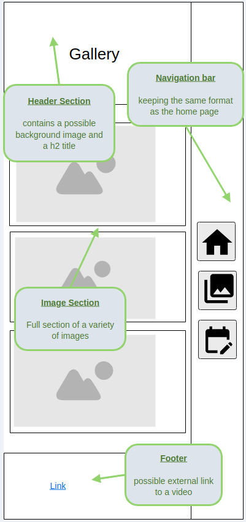

Form
  - 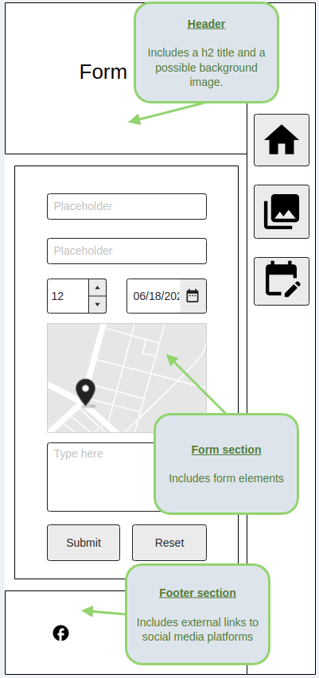

Confirmation
  - 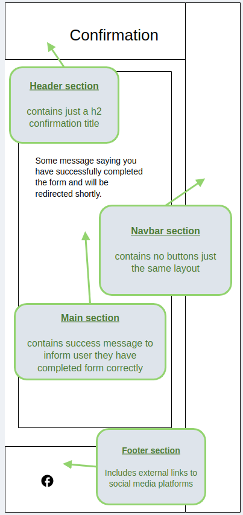  

404 Page
  - 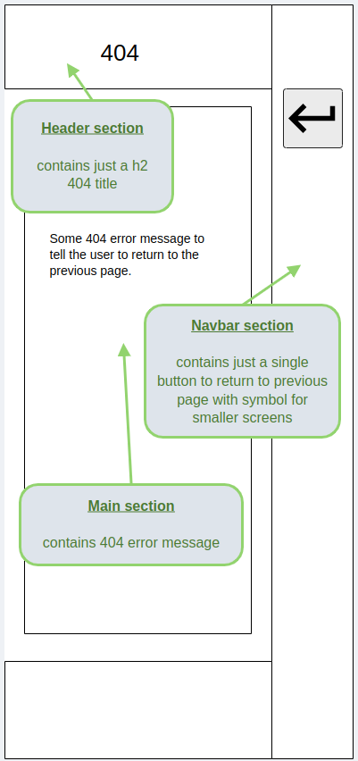

</details>

### Tablet Wireframes

<details>
<summary> Click here to see the Tablet Wireframes </summary>

Home
  - 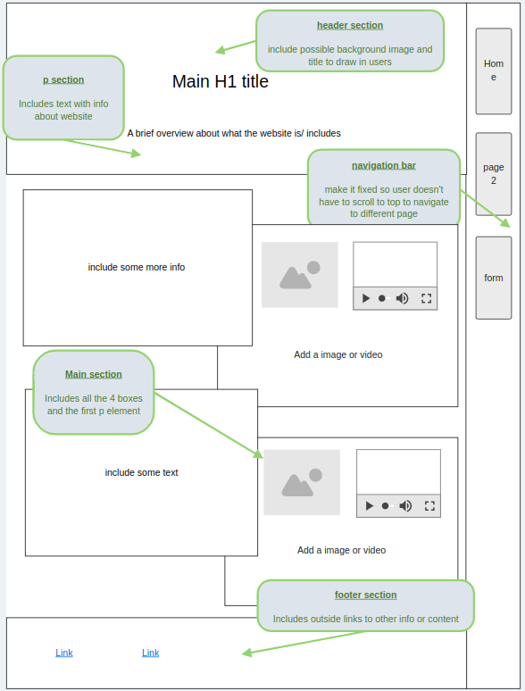

Gallery
  - 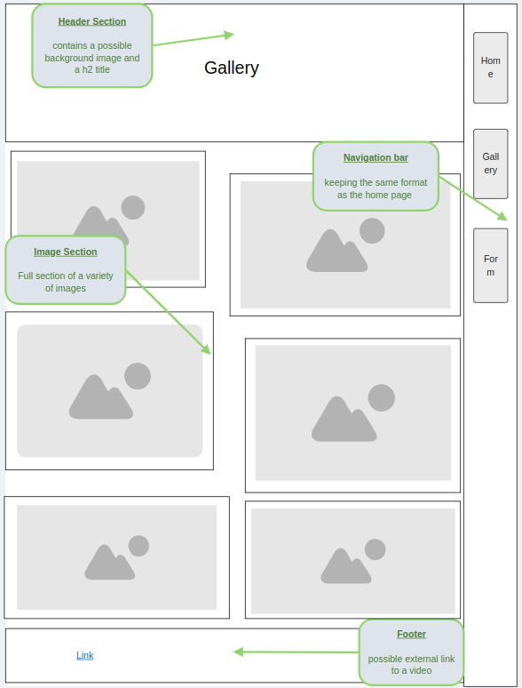

Form
  - 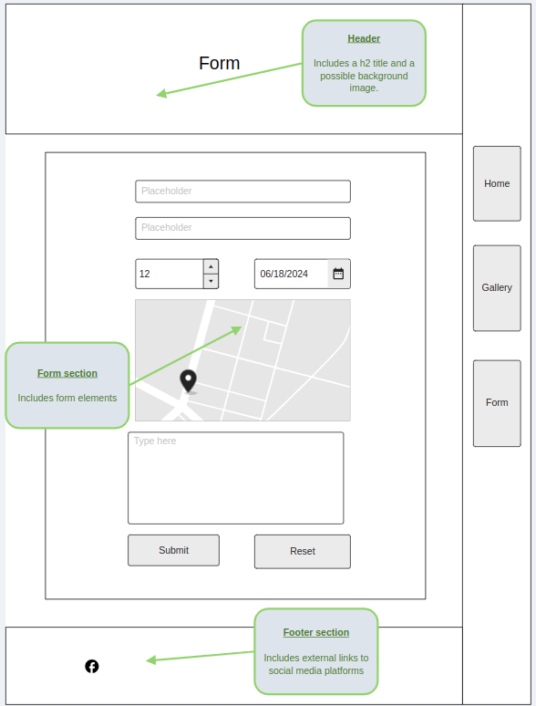

Confirmation
  -   

404
  - 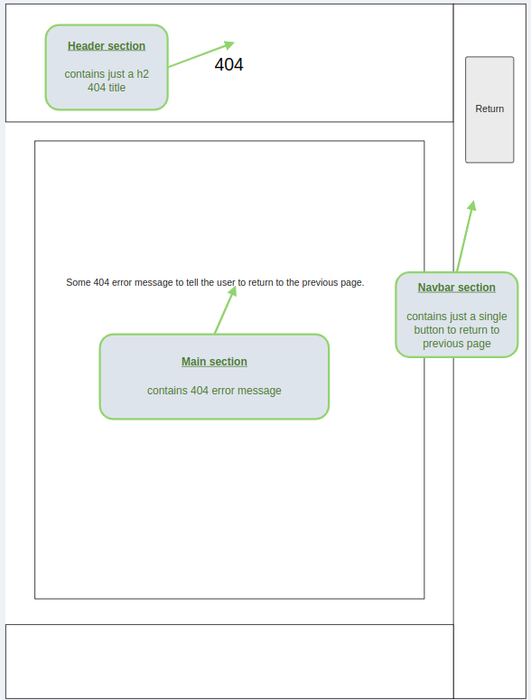

</details>

### Desktop Wireframes

<details>
<summary> Click here to see the Desktop Wireframes </summary>

Home
  - 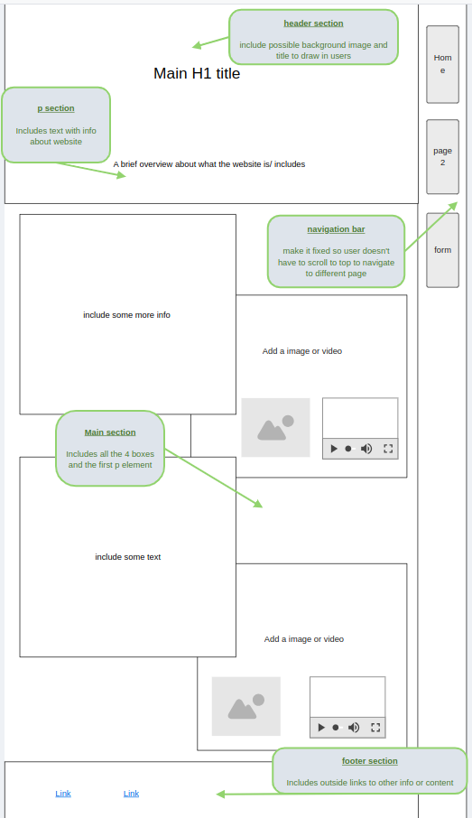

Gallery
  - 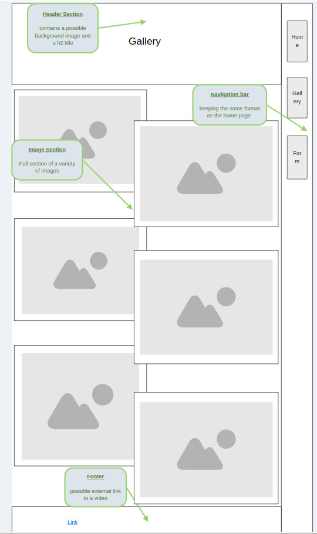

Form
  - 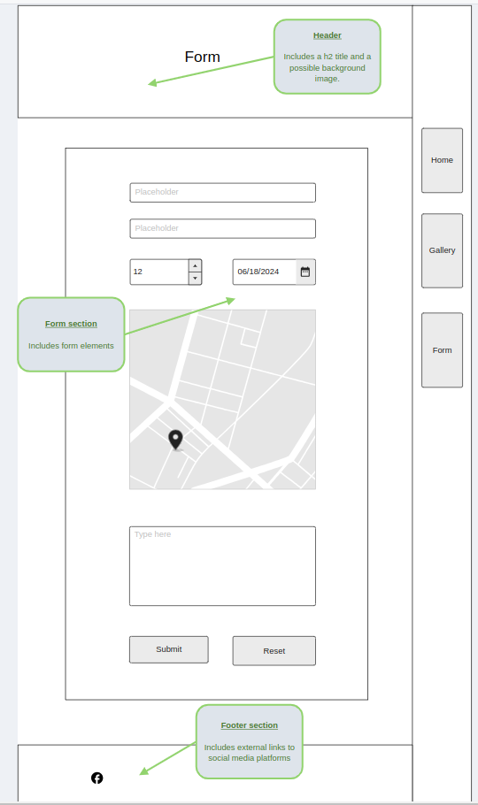

Confirmation
  - 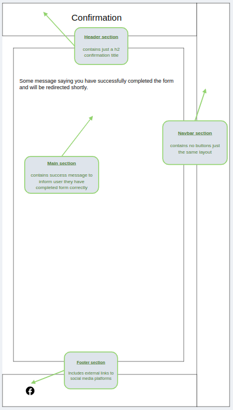  

404
  - 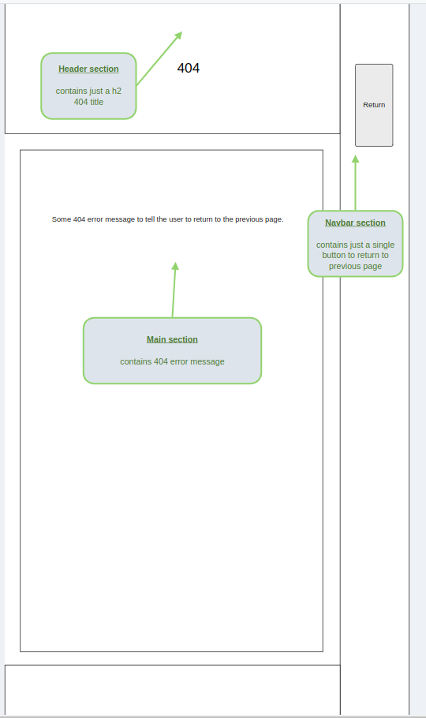

</details>

## Features

#### Header

  - The header contains the title of the current page, a background image or background colour and a brief description of what that page holds.

  <details>
  <summary>click here to see the Headers for each page</summary>
  <br>
  
  <br>
  
  <br>
  
  <br>
  
  </details>
  <br>
  
  </details>

#### Main

  - The main section on the first page will have informative blocks to tell the user about attractions and activities, like restaurants and tours. The text will also inform users of top quality accommodations. The first page will have visual pleasing images and videos of Kuwait. Using the colour scheme to design parts of the main section to make it pop and look professional.
  <details>
  <summary>click here to see the home page main section</summary>
  
  </details>
  <br>

  - The main section on the second page will contain a multitude of images and again using the colour scheme to design different parts of this section to give a consistent feel.

   <details>
  <summary>click here to see the gallery page main section</summary>
  
  </details>
  <br>

  - The main section on the third page will contain a form block so the user can fill out some personal details and two buttons to refresh the form and to submit the form where it will then take them to the confirmation page. This section will again follow the same colour scheme as the other sections.

   <details>
  <summary>click here to see the form page main section</summary>
  
  </details>
  <br>

   The main section of the confirmation page will contain text informing the user that they have successfully filled out the form and some one will be in-touch shortly and that they will be automatically returned to the home page. This will contain the same layout and colour scheme as the other 3 main pages.

   <details>
  <summary>click here to see the confirmation page main section</summary>
  
  </details>
  <br>

  - The main section of the 404 page will contain text informing the user that an error has occurred and they need to go back to the previous page.

   <details>
  <summary>click here to see the 404 page main section</summary>
  
  </details>

#### Navigation

  - This will be situated near the top of the site on screen widths smaller than 768px and down the left side on larger. It will contain three buttons so the user can switch between the three main pages. These buttons will be fixed to the screen, so as the user scrolls down, they will not have to scroll back up to change pages. It will follow the colour scheme as the rest of the page.
   <details>
  <summary>click here to see the navigation sections</summary>
  <br>
  
  <br>
  
  <br>
  
  </details>
  <br>

  - The 404 page navigation will still be featured at the side of the page but will only contain one button so the user doesn't have to click the back button and can just press the navigation one.

   <details>
  <summary>click here to see the 404 navigation section</summary>
  
  </details>

#### Footer

  - This will be situated at the bottom of each page and will contain external links and videos for the users and will follow a similar colour scheme as the rest of each page.

   <details>
  <summary>click here to see the footer sections</summary>
  <br>
  
  <br>
  
  <br>
  
  <br>
  
  <br>
  
  </details>

## Tools & Technologies Used

- [](https://tim.2bn.dev/markdown-builder) used to generate README and TESTING templates.
- [](https://git-scm.com) used for version control. (`git add`, `git commit`, `git push`)
- [](https://github.com) used for secure online code storage.
- [](https://gitpod.io) used as a cloud-based IDE for development.
- [](https://en.wikipedia.org/wiki/HTML) used for the main site content.
- [](https://en.wikipedia.org/wiki/CSS) used for the main site design and layout.
- [](https://pages.github.com) used for hosting the deployed front-end site.
- [](https://moqups.com/) used for creating wireframes.
- [](https://fontawesome.com) used for the icons.

## Testing

> [!NOTE]  
> For all testing, please refer to the [TESTING.md](TESTING.md) file.

## Deployment

The site was deployed to GitHub Pages. The steps to deploy are as follows:

- In the [GitHub repository](https://github.com/AshLaw96/kuwait-travel-website), navigate to the Settings tab 
- From the source section drop-down menu, select the **Main** Branch, then click "Save".
- The page will be automatically refreshed with a detailed ribbon display to indicate the successful deployment.

The live link can be found [here](https://ashlaw96.github.io/kuwait-travel-website)

### Local Deployment

This project can be cloned or forked in order to make a local copy on your own system.

#### Cloning

You can clone the repository by following these steps:

1. Go to the [GitHub repository](https://github.com/AshLaw96/kuwait-travel-website) 
2. Locate the Code button above the list of files and click it 
3. Select if you prefer to clone using HTTPS, SSH, or GitHub CLI and click the copy button to copy the URL to your clipboard
4. Open Git Bash or Terminal
5. Change the current working directory to the one where you want the cloned directory
6. In your IDE Terminal, type the following command to clone my repository:
 - `git clone https://github.com/AshLaw96/kuwait-travel-website.git`
7. Press Enter to create your local clone.

Alternatively, if using Gitpod, you can click below to create your own workspace using this repository.

[](https://gitpod.io/#https://github.com/AshLaw96/kuwait-travel-website)

Please note that in order to directly open the project in Gitpod, you need to have the browser extension installed.
A tutorial on how to do that can be found [here](https://www.gitpod.io/docs/configure/user-settings/browser-extension).

#### Forking

You can fork this repository by using the following steps:

1. Log in to GitHub and locate the [GitHub Repository](https://github.com/AshLaw96/kuwait-travel-website)
2. At the top of the Repository (not top of page) just above the "Settings" Button on the menu, locate the "Fork" Button.
3. Once clicked, you should now have a copy of the original repository in your own GitHub account!

### Local VS Deployment


## Credits

### Content

| Source | Location | Notes |
| --- | --- | --- |
| [Markdown Builder](https://tim.2bn.dev/markdown-builder) | README and TESTING | tool to help generate the Markdown files |
| [Github Repo](https://github.com/AshLaw96/my-love-running-project) | entire site | ideas on certain layout and structure |
| [Booking Website](https://www.booking.com/searchresults.en-gb.html?ss=Kuwait&efdco=1&label=gog235jc-1DCAEoggI46AdICVgDaFCIAQGYAQm4ARnIAQzYAQPoAQH4AQKIAgGoAgO4Asb-_7QGwAIB0gIkYjEzN2M0ZmMtNWU4Zi00YTk1LWE5MWItNGY0YmU0ZjE1MTk42AIE4AIB&aid=397594&lang=en-gb&sb=1&src_elem=sb&src=index&dest_id=113&dest_type=country&ac_position=0&ac_click_type=b&ac_langcode=en&ac_suggestion_list_length=5&search_selected=true&search_pageview_id=c5ec8663c09c0508&ac_meta=GhBjNWVjODY2M2MwOWMwNTA4IAAoATICZW46Bmt1d2FpdEAASgBQAA%3D%3D&group_adults=2&no_rooms=1&group_children=0) | booking.com | home page accommodation content |
| [W3Schools](https://www.w3schools.com/css/css3_variables.asp) | entire site | how to use CSS :root variables |
| [freeCodeCamp](https://www.freecodecamp.org/learn/2022/responsive-web-design/build-a-survey-form-project/build-a-survey-form) | form page | help design and structure the form |
| [W3Schools](https://www.w3schools.com/tags/att_meta_http_equiv.asp) | head in confirmation page | used to return to home page after required time |

### Media

| Source | Location | Type | Notes |
| --- | --- | --- | --- |
| [YouTube](https://www.youtube.com/watch?v=R35XF4-waFc) | bottom of gallery page | link | used to provide a video link of Kuwait |
| [Google](https://i0.wp.com/www.arabtimesonline.com/news/wp-content/uploads/2023/11/kuwait-city.jpg) | header on all pages | image | used for background image on header section |
| [Pexels](https://www.pexels.com) | entire site | image | majority of images throughout the site |
| [Videvo](https://www.videvo.net/search/?q=kuwait&mode=video) | home page | video | video on one of the block sections

### Acknowledgements

- I would like to thank my Code Institute mentor, [Tim Nelson](https://github.com/TravelTimN) for his support throughout the development of this project.
- I would like to thank the [Code Institute](https://codeinstitute.net) team for their assistance with the content information and videos to give me the knowledge to make this site.
- I would like to thank the [Code Institute Slack community](https://code-institute-room.slack.com) for the moral support; it kept me going during periods of self doubt and imposter syndrome.
- I would like to thank my partner (Megan Lawrence), for believing in me and the constant support, and allowing me to make this transition into software development.