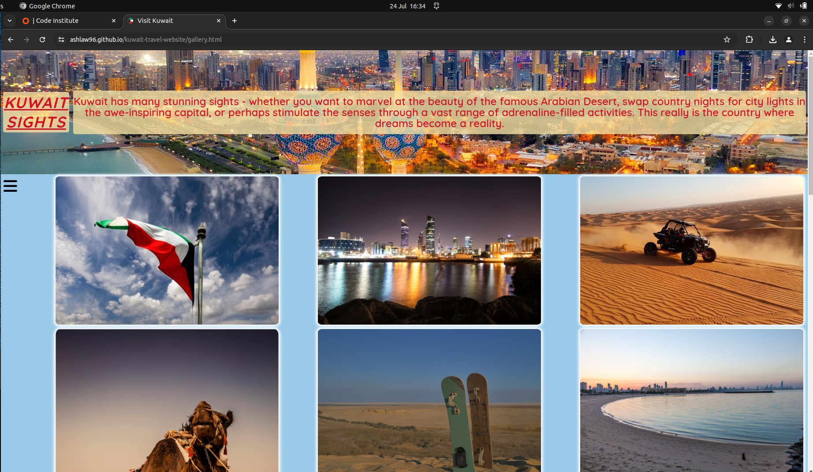

# Testing

> [!NOTE]  
> Return back to the [README.md](README.md) file.

Feature-by-Feature Testing:

- Navigation: I've ensured smooth transitions between pages and the links direct to the correct destinations.
- Responsive Design: I have checked for compatibility across various devices and screen sizes.
- Images/Videos: I have made sure that all images and videos are at high quality on different screen sizes. 
- Display: I verified that each page were properly showcased with accurate descriptions, images, and links.
- Form: I tested the form submission process, ensuring the user receives a confirmation message.

Click here to see website on different size devices

- Mobile

- Desktop

 
User Experience Testing:

- Usability Testing: I had users interact with the site and provide feedback.
1. 
2.
3.
- Accessibility Testing: I checked screen reader compatibility, proper alt text for images, and keyboard navigation would work.

Compatibility Testing:

- Browser Compatibility: I tested on different browsers, to ensure consistent performance.

- Device Compatibility: I ensured functionality across various devices.

Click here to see the site on different devices

- Huawei

- Dell

 
Performance Testing:

- Speed and Load Testing: I used PageSpeed Insights to check page load times and optimized where necessary.

- Scalability Testing: I assessed how the site handled increased traffic.

![screenshot] ()

Regression Testing:

Documentation and Logs:

- Whilst inputting my Favicon I notice when screens were in dark mode the image was visibly flawed. To fix this I had to change to a more clearer icon. 
  - The issue: [screenshot](documentation/issues/dark-favicon.png) 
  - The fix: [screenshot](documentation/issues/light-favicon.png)
  
User Feedback Incorporation:

## Code Validation

### HTML

I have used the recommended [HTML W3C Validator](https://validator.w3.org) to validate all of my HTML files.

| Directory | File | Screenshot | Notes |
| --- | --- | --- | --- |
| documentation/screenshot/ | index.html |  | no errors occurred when checking |
| documentation/screenshot | gallery.html |  | no errors occurred when checking |
| documentation/screenshot | form.html |  | no errors occurred when checking |
| documentation/screenshot | 404.html |  | no errors occurred when checking |
| documentation/screenshot | conformation.html |  | no errors occurred when checking |

### CSS

I have used the recommended [CSS W3C Validator](https://validator.w3.org) to validate my CSS file.

| Directory | File | Screenshot | Notes |
| --- | --- | --- | --- |
| documentation/validation/screenshot.png | css.styles |  | no errors occurred when checking |

## Browser Compatibility

- [Chrome](https://www.google.com/chrome)
- [Firefox](https://www.mozilla.org/firefox)
- [Edge](https://www.microsoft.com/edge)
- [Amazon Silk](https://www.amazon.co.uk/Amazon-com-Amazon-Silk-Web-Browser/dp/B01M35MQV4)

I've tested my deployed project on multiple browsers to check for compatibility issues.

| Browser | Home | Gallery | Form | 404 | Confirmation | Notes |
| --- | --- | --- | --- | --- | --- | --- |
| Chrome |  |  |  |  |  | Works as expected |
| Firefox |  |  |  |  |  | Works as expected |
| Edge |  |  |  |  |  | Works as expected |
| Amazon Silk |  |  |  |  |  | Works as expected |

## Responsiveness

I've tested my deployed project on multiple devices to check for responsiveness issues.

| Device | Home | Gallery | Form | 404 | Confirmation | Notes |
| --- | --- | --- | --- | --- | --- | --- |
| Mobile |  |  |  |  |   | Works as expected |
| Tablet |  |  |  |  |  | Works as expected |
| Desktop |  |  |  |  |  | Works as expected |
| XL Screen |  |  |  |  |  | Scaling starts to have minor issues |

## Lighthouse Audit

I've tested my deployed project using the Lighthouse Audit tool to check for any major issues.

| Page | Mobile | Desktop | Notes |
| --- | --- | --- | --- |
| Home |  |  | Some minor warnings |
| Gallery |  |  | Some minor warnings |
| Form |  |  | Some minor warnings |
| 404 |  |  | Some minor warnings |
| Confirmation |  |  | Some minor warnings |

## User Story Testing

| User Story | Screenshot |
| --- | --- |
| As a new site user, I would like to be able to quickly find where to stop, so that I can move on to decide what to pack. |  |
| As a new site user, I would like to change pages without having to scroll to the top of the screen, so that I can. |  |
| As a new site user, I would like to see a variety of images, so that I can see what Kuwait looks like. |  |
| As a new site user, I would like to see videos of what activities can be done, so that I can decide what I would like to do when I'm there. |  |
| As a new site user, I would like to be able to follow the websites social media, so that I can keep up to date with any new information. |  |
| As a returning site user, I would like to be able to keep my details in the form, so that I don't have to refill it every time I leave the site and return at a later date. |  |
| As a returning site user, I would like to be able to click on images and see them full-screen, so that I can see any particular image clearer. |  |
| As a returning site user, I would like to be able to easily understand the information given, so that I can tell others about it. |  |
| As a returning site user, I would like to watch more videos, so that I can see different food establishments. |  |
| As a returning site user, I would like to be able to click on links that take me to specific accommodation, so that I can find out more about what they have to offer. |  |
| As a site administrator, I should be able to see statistics, so that I can monitor the websites usage. |  |
| As a site administrator, I should be able to be notified when a user submits the form, so that I can examine the information provided and reply. |  |
| As a site administrator, I should be able to monitor how many users click on certain external links, so that I can update links if needed. |  |

## Bugs

> [!NOTE]  
> There are no remaining bugs that I am aware of.