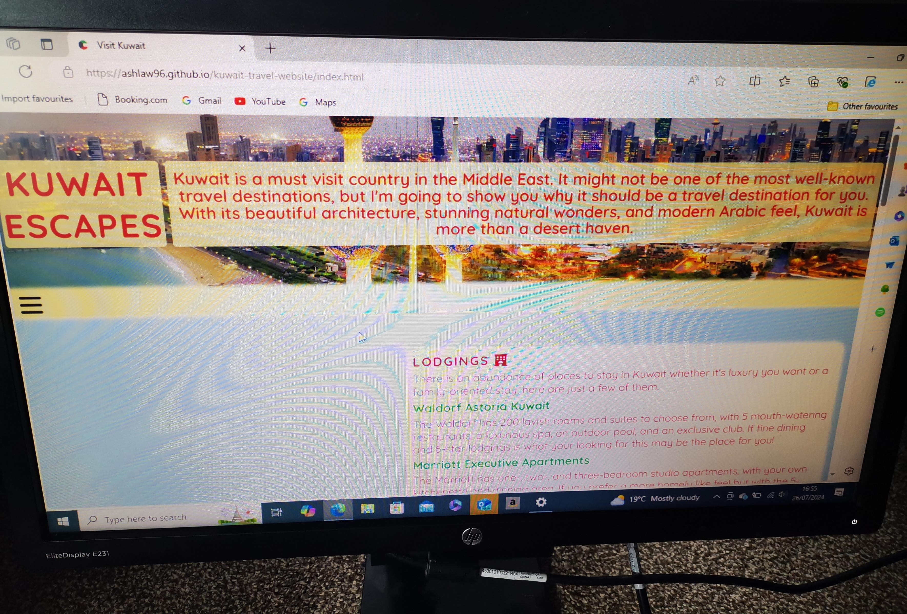

# Testing

> [!NOTE]  
> Return back to the [README.md](README.md) file.

Feature-by-Feature Testing:

- Navigation: I've ensured smooth transitions between pages and the links directed to the correct destinations.
- Responsive Design: I have checked for compatibility across various devices and screen sizes.
- Images/Videos: I have made sure that all images and videos are at high quality on different screen sizes. 
- Display: I verified that each page was properly showcased with accurate descriptions, images and links.
- Form: I tested the form submission process, ensuring the user receives a confirmation message.

User Experience Testing:

- Usability Testing: I had users interact with the site and provide feedback.
1. My first usability test was a mid-20s woman who considered herself a seasoned traveler who had been to Kuwait in the past year. She thought that the website reflected what the country had to offer well & enjoyed how people could pick their preferred location on the booking page, something which she would have liked when she booked her trip. She viewed this on her mobile and explained how it was easy to navigate and switch between pages thanks to the navigation bar always being present at the top. (Person has been to Kuwait)
2. A second interviewee was a 60-year-old gentleman who has not been to Kuwait but would like to visit in his lifetime. As an older subject, he thought it was an easy to navigate website which didn't overload him with information, but just enough for him to get a feel of how a trip could look for him. He especially enjoyed the range of accommodation on offer and liked the idea of hotels or self-catering accommodation. He also explained how the website links for accommodation were really helpful with brief descriptions helping decide which to explore further. He viewed this on his laptop and enjoyed that new tabs opened for each link, so he could go back and revisit pages. (Person wants to visit Kuwait)
3. The final person who used my website was a single mum in her 30s who hadn't known much about Kuwait as she holidays with her young son alone, so somewhere she never thought was an option. After seeing everything on offer through my website she explained how she would consider looking into the country more for a holiday as there was great knowledge on what to do, where to go and places to eat. She especially liked the gallery page as this gave her an insight as to what a holiday could look like for her. She mentioned how the gallery showcased a range of things, not anything specific. She viewed this on her phone and said it was easy to navigate, but thought there could be more in-depth information about visas & other minors things to consider when traveling such as money and holiday insurance. (Person doesn't want to visit Kuwait)

Accessibility Testing: I checked the screen readers compatibility, proper alt text for images, and that the keyboard navigation would work.

Compatibility Testing:

- Browser Compatibility: I tested on different browsers, to ensure consistent performance.

- Device Compatibility: I ensured functionality across various devices.

Performance Testing:

- Speed and Load Testing: I used PageSpeed Insights to check page load times and optimized where necessary.

Click here to see the speed tests of each page

- Home

- Gallery

- Form

- 404

- Confirmation

 

Scalability Testing: I assessed how the site handled increased traffic.

Regression Testing: I ensured that all features and functionalities worked as intended. 

Documentation and Logs:

- Whilst inputting my Favicon, I noticed when screens were in dark mode the image was visibly flawed. To fix this I had to change to a clearer icon. 
  - The issue: [Issue](documentation/issues/dark-favicon.png) 
  - The fix: [Fix](documentation/issues/light-favicon.png)

- Whilst designing my navigation bar, I noticed the height did not reached the desired height. To fix this required me to increase the vh to the height required.
  - The issue: [Issue](documentation/issues/bad-navbar-length.png)
  - The fix: [Fix](documentation/issues/good-navbar-length.png)

- Whilst completing the form, I became aware that my second fieldset was overlapping the width of my screen. To fix this I needed to change the width of my internal elements.
  - The issue: [Issue](documentation/issues/fieldset-large.png)
  - The fix: [Fix](documentation/issues/fieldset-small.png)

- Whilst making my form section, I became aware that my textarea was too small and the placeholder text was cut off slightly. To fix the issue I made the margin bigger so that the height could be increased making all the text visible.
  - The issue: [Issue](documentation/issues/small-textarea.png)
  - The fix: [Fix](documentation/issues/big-textarea.png)   

- Whilst checking my HTML validator, I found out that for correct validation some of my main content needed h1-h6 to be correct. To fix the issue I added h3 and used an id selector to hide the title. 
  - The issue: [Issue](documentation/screenshots/no-title.png)
  - The fix: [Fix](documentation/screenshots/title.png) 

- Whilst testing my HTML, I found out that I used the same id for multiple inputs on my form page. To fix this I changed the id of each and added a class indicator that was the same for each input.
  - The issue: [Issue](documentation/screenshots/same-id.png)
  - The fix: [Fix](documentation/screenshots/mix-id.png) 

## Code Validation

### HTML

I have used the recommended [HTML W3C Validator](https://validator.w3.org) to validate all of my HTML files.

| Directory | File | Screenshot | Notes |
| --- | --- | --- | --- |
| documentation/screenshot/home-check.png | index.html |  | no errors occurred when checking |
| documentation/screenshot/gallery-check.png | gallery.html |  | no errors occurred when checking |
| documentation/screenshot/form-check.png | form.html |  | no errors occurred when checking |
| documentation/screenshot/404-check.png | 404.html |  | no errors occurred when checking |
| documentation/screenshot/confirm-check.png | conformation.html |  | no errors occurred when checking |

### CSS

I have used the recommended [CSS W3C Validator](https://jigsaw.w3.org/css-validator/) to validate my CSS file.

| Directory | File | Screenshot | Notes |
| --- | --- | --- | --- |
| documentation/screenshots/css-check.png | css.styles |  | no errors occurred when checking |

## Browser Compatibility

- [Chrome](https://www.google.com/chrome)
- [Firefox](https://www.mozilla.org/firefox)
- [Bing](https://www.bing.com/)
- [Amazon Silk](https://www.amazon.co.uk/Amazon-com-Amazon-Silk-Web-Browser/dp/B01M35MQV4)
- [Edge](https://www.microsoft.com/en-gb/edge?form=MA13FJ)

I've tested my deployed project on multiple browsers to check for compatibility issues.

| Browser | Home | Gallery | Form | 404 | Confirmation | Notes |
| --- | --- | --- | --- | --- | --- | --- |
| Chrome |  |  |  |  |  | Works as expected |
| Firefox |  |  |  |  |  | Works as expected |
| Bing |  |  |  |  |  | Works as expected |
| Amazon Silk |  |  |  |  |  | Works as expected |
| Edge |  |  |  |  |  | Works as expected |

## Responsiveness

I've tested my deployed project on multiple devices to check for responsiveness issues.

| Device | Home | Gallery | Form | 404 | Confirmation | Notes |
| --- | --- | --- | --- | --- | --- | --- |
| Mobile |  |  |  |  |   | Works as expected |
| Tablet |  |  |  |  |  | Works as expected |
| Desktop |  |  |  |  |  | Works as expected |
| XL Screen |  |  |  |  |  | Layout has slight issues |

## Lighthouse Audit

I've tested my deployed project using the Lighthouse Audit tool to check for any major issues.

| Page | Mobile | Desktop | Notes |
| --- | --- | --- | --- |
| Home |  |  | Some warnings |
| Gallery |  |  | Some warnings |
| Form |  |  | Some minor warnings |
| 404 |  |  | Some minor warnings |
| Confirmation |  |  | Some minor warnings |

## User Story Testing

| User Story | Screenshot |
| --- | --- |
| As a new site user, I would like to be able to quickly find where to stop, so that I can move on to decide what to pack. |  |
| As a new site user, I would like to change pages without having to scroll to the top of the screen, so that I can quickly navigate the site. |  |
| As a new site user, I would like to see a variety of images, so that I can see what Kuwait looks like. |  |
| As a new site user, I would like to see videos of what activities can be done, so that I can decide what I would like to do when I'm there. |  |
| As a new site user, I would like to be able to follow the websites social media's, so that I can keep up to date with any new information. |  |
| --- | --- |
| As a returning site user, I would like to be able to keep my details in the form, so that I don't have to refill it every time I leave the site and return at a later date. | (JavaScript required) |
| As a returning site user, I would like to be able to click on images and see them full-screen, so that I can see any particular image clearer. | (Potential future add) |
| As a returning site user, I would like to be able to easily understand the information given, so that I can tell others about it. |  |
| As a returning site user, I would like to watch more videos, so that I can see different food establishments. |  |
| As a returning site user, I would like to be able to click on links that take me to specific accommodation, so that I can find out more about what they have to offer. |  |
| --- | --- |
| As a site administrator, I should be able to see statistics, so that I can monitor the websites usage. | (https://www.semrush.com/partner/semrushprotrial_11535?irclickid=WlL2EuwIYxyKRa30qrT6uyWVUkC2t-WFA2u4w80&irgwc=1) |
| As a site administrator, I should be able to be notified when a user submits the form, so that I can examine the information provided and reply. | (PHP required) |
| As a site administrator, I should be able to monitor how many users click on certain external links, so that I can update links if needed. | (https://marketingplatform.google.com/intl/en_uk/about/analytics/) |

## Bugs

Click here to view all images of found bugs

- Dark Favicon

  

- Small Navbar Height

  

- Over Large Fieldset Border

  

- Cut Off Placeholder Textarea

  

- No Title

  

- Same ID

  

 

- I will be more informative and not include full stops in future commits.

> [!NOTE]  
> There are no remaining bugs that I am aware of.